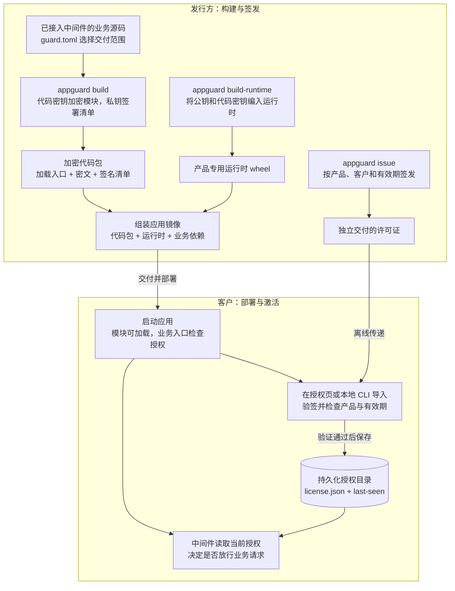
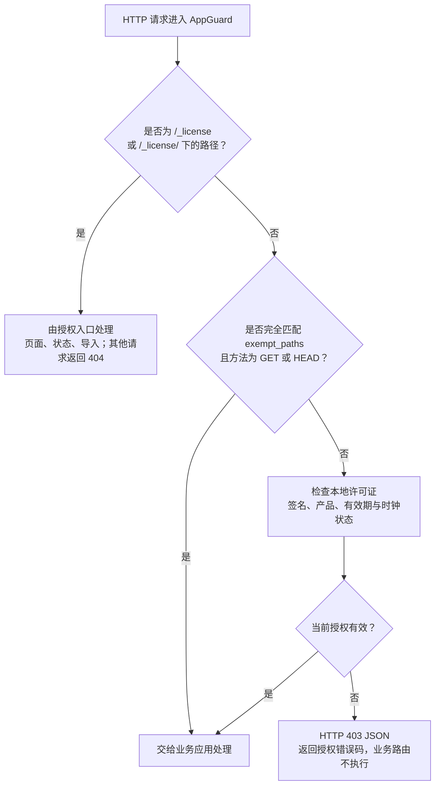

# AppGuard

为 Python Web 项目提供整模块代码加密交付和离线产品授权。发行方交付镜像与许可证，客户导入许可证后即可使用后端接口。代码保护与授权判断独立，不需要额外部署授权服务器。

当前支持 **CPython 3.11**，提供 **Flask、FastAPI 插件及 WSGI、ASGI 中间件**。运行环境的系统、CPU 架构和 Python 版本必须与原生运行时匹配。

## 安装

```sh
python3.11 -m pip install appguard-runtime==0.0.2
appguard --help
```

PyPI 上的 `appguard-runtime` 是发行方工具包，包含密钥生成、模块加密、许可证签发和原生运行时编译模板。它不包含任何产品密钥，也不直接安装客户侧的 `guard_runtime`、`appguard_host`、`appguard_flask` 或 `appguard_fastapi`。`appguard` 的所有子命令也可通过 `python -m appguard` 调用。

为产品生成一次密钥：

```sh
appguard keygen --out .data/issuer.key
appguard code-keygen --out .data/products/example-web/code.key
```

然后按[首次发行指南](https://github.com/baiyang/AppGuard/blob/main/docs/first-release.md)直接构建镜像。Flask 示例 Dockerfile 从 PyPI 安装固定版本 `appguard-runtime==0.0.1`，加密源码、编译产品运行时并组装交付镜像。复制到 FastAPI 或其他 ASGI 项目时，需将 Dockerfile 中的发行工具版本改为 `0.0.2`，并按下方接入说明调整运行依赖和启动命令。构建无需 AppGuard 仓库源码，宿主机无需预先生成加密包，也无需安装 C 编译器。密钥通过 BuildKit secrets 传入，最终镜像只包含运行依赖、产品运行时和加密应用。

后续发布复用密钥，重新执行镜像构建即可。每次构建都需保留指南中的 `--no-cache-filter protected-build`，确保加密和编译使用当前密钥。自行管理非 Docker 部署时，指南也提供独立构建加密包和私有运行时 wheel 的命令；不同产品应使用各自独立的容器或虚拟环境。

## 从这里开始

- **从示例源码构建并试用**：按 [Flask 示例](https://github.com/baiyang/AppGuard/blob/main/examples/flask/README.md)依次准备环境、生成密钥、执行 Docker 构建并启动验证。
- **第一次制作交付包**：按[首次发行指南](https://github.com/baiyang/AppGuard/blob/main/docs/first-release.md)完成打包、测试和交付。
- **已收到交付包**：按[示例部署说明](https://github.com/baiyang/AppGuard/blob/main/examples/flask/DEPLOY.md)启动应用并导入许可证。
- **接入自己的后端**：参考下方接入配置；密钥保存与轮换见[密钥说明](https://github.com/baiyang/AppGuard/blob/main/docs/keys.md)。
- **了解许可证内容和交付方式**：见[许可证格式](https://github.com/baiyang/AppGuard/blob/main/docs/keys.md#license-format)和 [Base64 交付步骤](https://github.com/baiyang/AppGuard/blob/main/docs/keys.md#base64-delivery)。
- **维护 AppGuard 版本**：见[版本与发布流程](https://github.com/baiyang/AppGuard/blob/main/docs/releases.md)。

## 命令总览

发行方安装公共包 `appguard-runtime` 后使用 `appguard`；部署端的 `appguard_host` 由产品专用运行时提供，示例镜像已安装。每条命令的完整参数、输入输出和使用示例见[命令参考](https://github.com/baiyang/AppGuard/blob/main/docs/cli.md)。

| 命令 | 在哪里执行 | 用途 |
| --- | --- | --- |
| `appguard keygen` | 发行方 | 生成签名私钥和对应公钥，首次准备时执行 |
| `appguard code-keygen` | 发行方 | 为产品生成代码加密密钥，后续构建复用 |
| `appguard build` | 发行方或 Docker 构建阶段 | 按 `guard.toml` 加密 Python 模块并签署清单 |
| `appguard build-runtime` | 发行方或 Docker 构建阶段 | 使用产品密钥编译部署端的原生运行时 wheel |
| `appguard issue` | 发行方 | 签发产品许可证，续期时指定新到期时间重新签发 |
| `appguard inspect` | 发行方 | 查看许可证或清单的元数据，不验证签名 |
| `python -m appguard_host status` | 应用容器或部署环境 | 查看当前产品的授权状态 |
| `python -m appguard_host install` | 应用容器或部署环境 | 导入许可证，激活或续期，无需重启 |

先生成一次密钥，再构建产品，最后签发并导入许可证。使用示例 Dockerfile 时，`build` 和 `build-runtime` 已在镜像构建期间自动执行。

在终端查看帮助：

```sh
appguard --help
appguard issue --help
python -m appguard --help
```

将 `issue` 换成其他子命令名即可查看相应参数。`appguard ...` 也可写成 `python -m appguard ...`，请使用已安装工具包的 Python 环境。

## 架构与边界

AppGuard 的交付过程分为三个阶段：**发行方把业务源码做成加密应用，客户启动应用并导入许可证，中间件在业务请求入口检查授权。** 验签、解密和有效期检查都在客户的应用进程中完成，运行时无需连接发行方，也无需部署独立的授权服务。

### 1. 先理解代码保护与使用授权的分工

| 机制 | 解决什么问题 | 何时执行 | 依赖什么 |
| --- | --- | --- | --- |
| 代码保护 | 交付文件中不包含选中的业务 Python 明文源码 | 构建时加密；运行时在模块导入时解密、执行 | 加密代码包、内置公钥和产品代码密钥的原生运行时 |
| 使用授权 | 决定当前是否允许业务请求进入应用 | 每次新的 HTTP 业务请求或 WebSocket 握手到达时 | 授权中间件、本地许可证、系统时间及辅助时钟记录 |

这两个机制独立工作：**许可证不携带代码解密密钥，许可证缺失或到期不会阻止模块加载。** 因此，应用可以先启动并提供授权页面；业务接口是否可用，由入口处的授权中间件决定。应用启动仍要求代码包完整、运行时匹配，以及业务自身的依赖和配置就绪。

### 2. 从源码到客户部署

下面两条交付路径在客户环境中汇合：代码包与运行时组成应用镜像，许可证按产品和客户单独签发。多个客户可以使用同一产品镜像，各自导入收到的许可证。



实际接入时按以下顺序操作：

1. **确定产品与保护范围。** 在 `guard.toml` 中设置稳定的 `product_id` 和交付文件范围；在 Flask/FastAPI 应用完成其他中间件配置后注册 AppGuard。此时仍然维护和开发原始业务源码。
2. **首次准备密钥。** 发行方用 `keygen` 生成 Ed25519 签名私钥 `issuer.key` 和公钥 `issuer.pub`，每个产品用 `code-keygen` 生成自己的 `code.key`。私钥签署代码清单和许可证，公钥验证签名，代码密钥负责模块加解密。后续普通发布复用这些密钥。
3. **构建代码包与运行时。** `build` 将选中的 `.py` 整模块编译为字节码，再用 AES-GCM 加密成 `.agc`，同时生成加载入口和签名清单；`build-runtime` 将公钥、代码密钥编入原生扩展，并与框架适配器一起打成私有 wheel。业务模块的加密构建与原生运行时的编译是两个独立步骤。
4. **组装并交付应用。** 将代码包、已安装的产品运行时和业务依赖放入镜像。示例 Dockerfile 自动完成第 3、4 步；最终镜像不包含业务明文源码、签名私钥、独立代码密钥文件或预装许可证。客户无需编译工具。
5. **单独签发许可证。** 发行方用 `issue` 指定产品、客户和有效期，得到带签名的许可证。此步骤不读取业务源码、代码密钥或某次构建目录，也可以在镜像构建之前完成。许可证经离线渠道交给客户，具体文件格式见下方“签发、激活与续期”。
6. **部署、激活并验证。** 客户启动应用，挂载可写、持久化的授权目录，通过 `/_license/` 或 `python -m appguard_host install` 导入许可证。验证通过后，后续业务请求即可放行；再访问业务接口确认结果。

首次发行的可执行命令见[首次发行指南](docs/first-release.md)，中间件注册代码见下方“接入自己的后端”。

### 3. 客户环境中具体运行什么

| 组成 | 内容与职责 | 更新方式 |
| --- | --- | --- |
| 应用目录（构建输出 `bundle/tree/`） | 保留原项目目录结构；选中的 `.py` 替换为调用运行时的加载入口，选中的非 Python 文件原样复制 | 随业务版本更新；示例镜像将其放在 `/app/` |
| 密文与清单（`bundle/modules/`、`bundle/manifest.json`） | `.agc` 保存加密模块；签名清单记录产品、构建、模块位置和密文摘要，用于校验并定位模块 | 与加载入口作为同一份构建产物交付 |
| 产品运行时（`appguard-product-runtime`） | 包含原生模块 `guard_runtime`、框架适配器及 `appguard_host`；负责模块加载、授权检查、授权页面和本地 CLI | 与公钥、产品代码密钥及目标系统、架构、CPython 版本匹配；这些条件及运行时代码不变时可复用 |
| 授权目录（`APPGUARD_LICENSE_DIR`） | `license.json` 保存已导入的许可证，`last-seen` 保存辅助时钟记录；由运行时读写 | 许可证在激活或续期时更新，时钟记录在运行中更新；替换容器时保留 |

公共包 `appguard-runtime` 用于发行方构建，私有包 `appguard-product-runtime` 用于客户运行；客户无需安装发行工具。**`issuer.key` 始终由发行方保存；`issuer.pub` 和 `code.key` 的值随原生运行时交付。** 把密钥编进二进制可以避免直接交付独立密钥文件，但不能保证主机管理员无法提取它们。

### 4. 启动和业务请求分别经历什么

**应用启动与模块导入：** Python 按原有入口启动 Flask/FastAPI 应用。导入受保护模块时，加载入口调用 `guard_runtime`；运行时首次加载清单时验证签名并确认代码包与运行时匹配，之后复用已验证的清单。各模块加载时验证对应密文，在内存中解密、执行；后续延迟导入的模块也按此流程加载。这个过程不检查许可证，也不把解密后的明文字节码写回磁盘。

代码包损坏或运行时不匹配会使模块加载失败，因此“未激活也能启动”只针对许可证状态，并不意味着可以忽略代码包错误。

**每次 HTTP 请求：** 在进入业务路由之前，AppGuard 按下图处理。授权页和显式配置的存活探针可以在未激活时使用，其余路径默认都受保护，包括 FastAPI 文档接口和不存在的业务路径。



每次受保护请求都会检查许可证文件是否变化及当前有效期；首次读取或文件变化时重新验签。验签结果的缓存不会跳过到期检查，所以运行中的服务到期后，下一个请求就会被拒绝。ASGI 适配器将同步授权检查放到工作线程执行，业务请求体和流式响应直接透传。

例如，未导入许可证时，请求 `/api/answer` 会得到 HTTP 403：

```json
{"error": "当前产品未获得有效授权", "code": "LICENSE_MISSING"}
```

到期时错误码为 `LICENSE_EXPIRED`。后端保持 JSON 响应；前端可以识别授权错误码后引导用户进入授权页，不能把业务自身的所有 403 都当作许可证错误。

WebSocket 在握手时检查授权，无效时拒绝建立连接；HTTP 的授权页面和健康路径豁免不适用于 WebSocket。ASGI 的启动、关闭事件正常传递。

### 5. 激活、续期与业务升级怎样衔接

导入许可证时，运行时先检查签名、产品和有效期，验证通过后才替换授权目录中的 `license.json`。被拒绝的许可证不会覆盖原有许可证。各工作进程在后续请求中发现文件变化并重新加载，因此激活、续期无需重启应用。

| 场景 | 发行方需要做什么 | 客户需要做什么 |
| --- | --- | --- |
| 首次使用 | 交付产品镜像，并为客户签发许可证 | 启动应用、挂载授权目录、导入许可证 |
| 仅延长授权时间 | 用同一签名私钥为同一产品签发新有效期的许可证 | 在运行中的应用里导入新许可证，无需更换镜像 |
| 普通业务版本升级 | 保持产品标识和密钥不变，重新构建并交付镜像 | 更新镜像并继续挂载原授权目录；有效许可证继续使用 |
| 更换产品代码密钥 | 重新加密业务模块并重建匹配的运行时 | 更新代码包和运行时；产品和签名公钥未变时，原有效许可证仍可使用 |
| 更换签名密钥 | 使用新密钥签署清单，重建内置新公钥的运行时，并重新签发许可证 | 更新配套镜像并导入新许可证 |

例如，同一个产品从版本 A 升级到版本 B，即使 `build_id` 改变，只要产品标识与签名公钥保持一致，未到期的许可证仍然有效。许可证中的 `customer` 记录签发对象；当前实现不会把它与机器或部署端登录身份绑定。

### 6. 保护范围与明确限制

| 范围 | 当前行为与限制 |
| --- | --- |
| 交付代码 | 加密 `guard.toml` 选中的 Python 模块，在加载时校验清单与模块密文；未选中的文件不进入代码包，选中的非 Python 文件原样复制。前端 HTML、JavaScript、CSS 不会因此加密，静态资源与外部依赖也不在这份签名清单的校验范围内。 |
| Web 业务入口 | 授权检查覆盖经过 AppGuard 的新 HTTP 业务请求及 WebSocket 握手。必须把中间件接在业务入口，并仅为必要的存活探针配置豁免。Nginx 等其他进程直接提供的内容不经过这层检查。 |
| 进程内执行 | CLI、后台任务和直接函数调用不受该中间件控制；已开始的请求、流式响应和已建立的 WebSocket 连接不会因到期被中断。代码解密独立于授权，移除中间件后仍可调用业务逻辑。 |
| 客户主机控制权 | 避免直接交付可读的业务源码，但不保证抵抗主机管理员提取二进制密钥、读取进程内存或修改运行程序。依赖和容器封装不能消除这个限制。 |
| 许可证复制与撤销 | 许可证不绑定机器、安装实例或构建版本，可复制到同产品且使用相同签名公钥的其他部署；没有在线吊销、席位计数或客户身份校验。 |
| 离线时间 | 使用系统时间和持久化的辅助时钟记录检测部分时间回退；无法阻止管理员恢复整机或授权卷快照，不提供独立可信时钟。 |

这套方案适用于需要离线交付加密 Python 应用、并在 Web 入口按产品有效期限制使用的场景。账号权限、数据库、后台任务、前端路由及业务自身的部署流程仍由应用负责。

## 接入自己的后端

Flask 项目在应用与其他中间件配置完成后，最后注册 AppGuard，使授权检查位于业务入口最外层：

```python
from appguard_flask import AppGuard

AppGuard().init_app(app)
```

FastAPI 和 ASGI 支持从 `0.0.2` 开始，需使用 `appguard-runtime==0.0.2` 重新构建产品运行时。FastAPI 项目安装产品专用运行时 wheel 时，添加 `[fastapi]` 以安装适配器依赖；将下方文件名替换为 `appguard build-runtime` 实际生成的 wheel 路径：

```sh
python3.11 -m pip install '/path/to/appguard_product_runtime-0.0.2-cp311-cp311-linux_x86_64.whl[fastapi]'
```

复用 Flask Dockerfile 时，将 `publisher` 阶段的安装版本改为 `appguard-runtime==0.0.2`，在应用的 `requirements.txt` 中加入 `fastapi` 和所选 ASGI 服务器（如 `uvicorn`），并将启动命令改为对应的 ASGI 入口。

在配置其他中间件之后、应用开始处理请求之前，最后注册 AppGuard：

```python
from fastapi import FastAPI
from appguard_fastapi import AppGuard

app = FastAPI()

@app.get("/healthz")
async def health():
    return {"ok": True}

AppGuard(app, exempt_paths=("/healthz",))
```

应用工厂也可使用 `AppGuard(exempt_paths=("/healthz",)).init_app(app)`。需要 FastAPI 原生注册方式时，将上方最后一行替换为：

```python
from appguard_fastapi import LicenseMiddleware

app.add_middleware(LicenseMiddleware, exempt_paths=("/healthz",))
```

两种注册方式选择其一。FastAPI 的 `/docs`、`/redoc`、`/openapi.json` 默认也受授权保护；`/_license/` 及其状态、导入接口始终可用。WebSocket 仅在连接握手时校验授权，未授权时拒绝连接，已建立的连接不因许可证到期而主动断开。路径豁免仅适用于 HTTP GET/HEAD，不豁免 WebSocket。

其他 WSGI 后端在完成应用组装后包装入口：

```python
from appguard_host import LicenseMiddleware

application = LicenseMiddleware(application)
```

默认没有业务路径豁免。需要存活探针时，可显式配置 `AppGuard(exempt_paths=("/healthz",))` 或 `LicenseMiddleware(application, exempt_paths=("/healthz",))`；仅完全匹配路径的 GET/HEAD 请求免授权，不按目录前缀放行。探针应只报告进程存活，不暴露业务数据。

在 `guard.toml` 中选择交付文件，不需要配置函数、检查点或改写业务函数：

```toml
product_id = "my-web-app"
include = ["src/", "scripts/cli.py", "templates/", "static/"]
exclude = ["**/__pycache__/", "**/.env*", "**/*.pyc"]
```

路径相对于应用项目根目录，即 Docker 构建的 `application` 上下文或独立命令的 `build --source`，支持文件、目录和通配符；按自己的项目实际文件调整选择范围。选中的 Python 模块整体加密；非 Python 文件原样复制，需排除私密配置、开发文件和生成的 C 源文件。

[Flask 示例](https://github.com/baiyang/AppGuard/blob/main/examples/flask/README.md)采用 `src/example_web/` 业务包和 `scripts/` 脚本目录。其配置只交付 `src/` 和业务命令 `scripts/cli.py`，构建、验证脚本不进入镜像。加密后保留目录结构，Dockerfile 通过 `PYTHONPATH=/app/src` 加载业务包，以 `example_web.web_app:app` 启动 Gunicorn，并从项目根目录的 `requirements.txt` 安装依赖。系统依赖、数据库初始化及后台任务仍由业务项目自己的部署流程负责。

## 签发、激活与续期

发行方知道产品标识、客户标识和到期时间后即可签发，不再收集部署申请：

```sh
python -m appguard issue \
  --product example-web --issuer-key .data/issuer.key \
  --customer customer-001 --expires 2027-12-31T23:59:59Z \
  --out .data/customer-001.license
```

`issue` 输出原始签名 JSON，发行方留存该文件供检查和命令行导入。交付前，将整个文件编码为单行 Base64：

```sh
python - <<'PY'
import base64
from pathlib import Path

source = Path(".data/customer-001.license")
target = Path(".data/delivery/customer-001.b64.license")
encoded = base64.b64encode(source.read_bytes()).decode("ascii")
target.parent.mkdir(parents=True, exist_ok=True)
with target.open("x", encoding="ascii") as output:
    output.write(encoded + "\n")
print(target)
PY
```

把 `.data/delivery/customer-001.b64.license` 交给客户。客户在电脑浏览器中打开 `http://服务器地址:8000/_license/`，在“许可证文件”处选择收到的文件，点击“激活授权”；也可将文件的完整单行内容粘贴到“授权码”输入框。Base64 是可逆编码，不提供保密性；许可证由数字签名防篡改，详见[许可证格式与校验](https://github.com/baiyang/AppGuard/blob/main/docs/keys.md#license-format)。

授权有效后，示例的 `/api/answer?value=8` 返回 `{"answer":50}`。缺失或过期授权时，该接口及其他业务路径均返回 403 JSON。

续期时指定新的到期时间和输出文件，重新签发后导入即可。相同发行方和产品的新构建继续使用原有效许可证；不需要保存每个构建的秘密 `release.json`。授权卷只保存许可证和辅助时钟记录，重建容器时继续挂载。

部署端也可使用命令行查看或导入授权。`install` 仅接受 `issue` 生成的原始签名 JSON；只有 Base64 交付文件时，先按[解码步骤](https://github.com/baiyang/AppGuard/blob/main/docs/keys.md#base64-delivery)恢复原始文件：

```sh
python -m appguard_host status
python -m appguard_host install /path/to/customer-001.license
```

## 配置与迁移

| 环境变量 | 默认值 | 用途 |
| --- | --- | --- |
| `APPGUARD_BUNDLE` | `/opt/appguard/bundle` | 加密模块及签名清单目录 |
| `APPGUARD_LICENSE_DIR` | `/var/lib/appguard` | 可写、持久化的授权目录 |
| `APPGUARD_SECURE_COOKIE` | `0` | HTTPS 部署时设为 `1` |

无法激活时查看 `/_license/` 的状态提示，确认许可证产品、发行方、有效期与系统时间。运行时需与产品代码密钥匹配，但不要求每次业务构建重新编译。

旧版 `function-bodies-v1` 包和绑定 `build_id` 的许可证不能直接用于新版。首次迁移需要移除旧函数配置、生成产品代码密钥、重新构建镜像，并重新签发产品许可证。此后普通更新可复用许可证；迁移细节见[首次发行指南](https://github.com/baiyang/AppGuard/blob/main/docs/first-release.md#从旧版迁移)。
