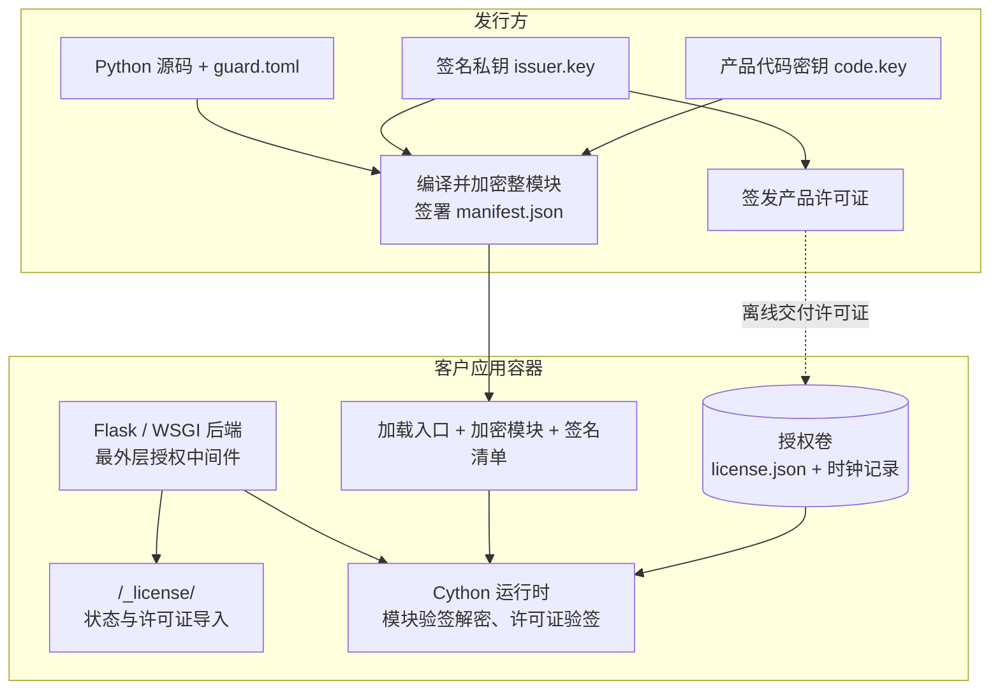

# AppGuard

为 Python Web 项目提供整模块代码加密交付和离线产品授权。发行方交付镜像与许可证，客户导入许可证后即可使用后端接口。代码保护与授权判断独立，不需要额外部署授权服务器。

当前支持 **CPython 3.11**，提供 **Flask 插件和 WSGI 中间件**。ASGI 需要另行适配；运行环境的系统、CPU 架构和 Python 版本必须与原生运行时匹配。

## 安装

```sh
python3.11 -m pip install appguard-runtime==0.0.1
appguard --help
```

PyPI 上的 `appguard-runtime` 是发行方工具包，包含密钥生成、模块加密、许可证签发和原生运行时编译模板。它不包含任何产品密钥，也不直接安装客户侧的 `guard_runtime`、`appguard_host` 或 `appguard_flask`。所有命令也可通过 `python -m appguard` 调用。

为产品生成一次密钥，然后在与目标部署相同的系统、CPU 架构和 CPython 3.11 环境中编译客户运行时（需要 C 编译器和 Python 开发头文件）：

```sh
appguard keygen --out .data/issuer.key
appguard code-keygen --out .data/code.key
appguard build-runtime --public-key .data/issuer.pub \
  --code-key .data/code.key --out .data/runtime
```

生成的 `appguard_product_runtime-0.0.1-*.whl` 包含客户侧插件和编入产品密钥的原生模块，仅随对应产品私下交付，不能上传到公共包仓库。客户使用 `python -m pip install /path/to/appguard_product_runtime-0.0.1-*.whl` 安装；不同产品应使用各自独立的容器或虚拟环境。应用加密和完整镜像交付步骤见[首次发行指南](https://github.com/baiyang/AppGuard/blob/main/docs/first-release.md)。

## 从这里开始

- **第一次制作交付包**：按[首次发行指南](https://github.com/baiyang/AppGuard/blob/main/docs/first-release.md)完成打包、测试和交付。
- **已收到交付包**：按[示例部署说明](https://github.com/baiyang/AppGuard/blob/main/examples/flask/DEPLOY.md)启动应用并导入许可证。
- **接入自己的后端**：参考下方接入配置；密钥保存与轮换见[密钥说明](https://github.com/baiyang/AppGuard/blob/main/docs/keys.md)。
- **维护 AppGuard 版本**：见[版本与发布流程](https://github.com/baiyang/AppGuard/blob/main/docs/releases.md)。

## 架构与边界



系统只维护三种长期密钥值：发行方签名私钥 `issuer.key`、对应验签公钥 `issuer.pub`、每产品固定的代码密钥 `code.key`。公钥和代码密钥编入运行时；签名私钥不交付。普通应用更新复用产品代码密钥和运行时，无需重新签发未到期的产品许可证。

- **代码保护**：构建端用 `compile` / `marshal` 生成整模块字节码，再用 AES-GCM 加密为 `.agc`。镜像内的 `.py` 仅为加载入口；运行时验签、解密后在内存执行，不将明文字节码写回磁盘。
- **后端授权**：中间件在每个业务请求进入应用之前验签并检查有效期。未授权、过期或许可证无效时，所有业务路径统一返回 **HTTP 403 JSON**，不依据 `Accept`、路径前缀或浏览器类型重定向。
- **授权页面**：`/_license/`、状态与导入接口独立开放。应用未授权也能启动，客户可随时导入续期许可证，无需重启。
- **前后端分离**：前端 HTML、JavaScript、CSS 不是加密目标。前端统一处理后端授权错误并跳转授权页；本项目不接管前端路由。不要把所有业务 403 都当作授权到期，应检查响应的授权错误码。

加密让客户拿不到可直接阅读的业务 Python 源码，不保证抵抗主机管理员提取二进制密钥、内存代码或修改运行程序。代码密钥随运行时交付，许可证不承载解密密钥；移除授权中间件后可以调用业务逻辑。这是精简方案的明确边界。

授权只控制新进入的 HTTP 业务请求，不控制 CLI、后台任务、直接函数调用，也不中断已开始的请求或流式响应。离线时钟回退检测只用于辅助发现异常，无法阻止管理员恢复整机或授权卷快照。产品许可证不绑定机器或构建版本，同一许可证可复制到同产品的其他部署。

## 接入自己的后端

Flask 项目在应用与其他中间件配置完成后，最后注册 AppGuard，使授权检查位于业务入口最外层：

```python
from appguard_flask import AppGuard

AppGuard().init_app(app)
```

其他 WSGI 后端在完成应用组装后包装入口：

```python
from appguard_host import LicenseMiddleware

application = LicenseMiddleware(application)
```

默认没有业务路径豁免。需要存活探针时，可显式配置 `AppGuard(exempt_paths=("/healthz",))` 或 `LicenseMiddleware(application, exempt_paths=("/healthz",))`；仅完全匹配路径的 GET/HEAD 请求免授权，不按目录前缀放行。探针应只报告进程存活，不暴露业务数据。

在 `guard.toml` 中选择交付文件，不需要配置函数、检查点或改写业务函数：

```toml
product_id = "my-web-app"
include = ["web_app.py", "service.py", "templates/", "static/"]
exclude = ["**/__pycache__/", "**/.env*", "**/*.pyc"]
```

路径相对于 `build --source`，支持文件、目录和通配符。选中的 Python 模块整体加密；非 Python 文件原样复制，需排除私密配置、开发文件和生成的 C 源文件。依赖安装、数据库初始化及后台任务仍由业务项目自己的部署流程负责。

## 签发、激活与续期

发行方知道产品标识、客户标识和到期时间后即可签发，不再收集部署申请：

```sh
python -m appguard issue \
  --product example-web --issuer-key .data/issuer.key \
  --customer customer-001 --expires 2027-12-31T23:59:59Z \
  --out .data/customer-001.license
```

客户在 `http://服务器地址:8000/_license/` 上传许可证。授权有效后，示例的 `/api/answer?value=8` 返回 `{"answer":50}`。缺失或过期授权时，该接口及其他业务路径均返回 403 JSON。

续期时指定新的到期时间和输出文件，重新签发后导入即可。相同发行方和产品的新构建继续使用原有效许可证；不需要保存每个构建的秘密 `release.json`。授权卷只保存许可证和辅助时钟记录，重建容器时继续挂载。

部署端也可使用命令行查看或导入授权：

```sh
python -m appguard_host status
python -m appguard_host install /path/to/customer-001.license
```

## 配置与迁移

| 环境变量 | 默认值 | 用途 |
| --- | --- | --- |
| `APPGUARD_BUNDLE` | `/opt/appguard/bundle` | 加密模块及签名清单目录 |
| `APPGUARD_LICENSE_DIR` | `/var/lib/appguard` | 可写、持久化的授权目录 |
| `APPGUARD_SECURE_COOKIE` | `0` | HTTPS 部署时设为 `1` |

无法激活时查看 `/_license/` 的状态提示，确认许可证产品、发行方、有效期与系统时间。运行时需与产品代码密钥匹配，但不要求每次业务构建重新编译。

旧版 `function-bodies-v1` 包和绑定 `build_id` 的许可证不能直接用于新版。首次迁移需要移除旧函数配置、生成产品代码密钥、重新构建镜像，并重新签发产品许可证。此后普通更新可复用许可证；迁移细节见[首次发行指南](https://github.com/baiyang/AppGuard/blob/main/docs/first-release.md#从旧版迁移)。
