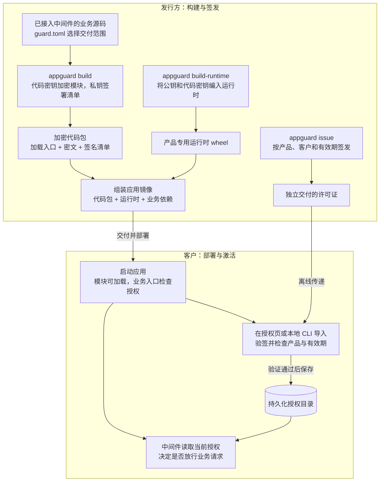
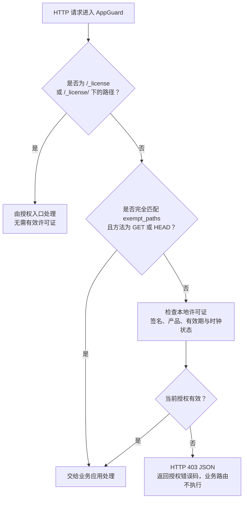

# AppGuard

为 Python Web 项目提供整模块代码加密交付和离线产品授权。发行方交付镜像与许可证，客户导入许可证后即可使用后端接口。代码保护与授权判断独立，不需要额外部署授权服务器。

当前支持 **CPython 3.11**，提供 **Flask、FastAPI 插件及 WSGI、ASGI 中间件**。运行环境的系统、CPU 架构和 Python 版本必须与原生运行时匹配。

## 安装

```sh
python3.11 -m pip install appguard-runtime==0.0.2
appguard --help
```

PyPI 上的 `appguard-runtime` 是发行方工具包，用于生成密钥、加密模块、签发许可证和构建产品运行时。客户部署使用构建出的产品专用运行时，示例镜像已包含它。`appguard` 的所有子命令也可通过 `python -m appguard` 调用。

为产品生成一次密钥：

```sh
appguard keygen --out .data/issuer.key
appguard code-keygen --out .data/products/example-web/code.key
```

然后按[首次发行指南](https://github.com/baiyang/AppGuard/blob/main/docs/first-release.md)构建镜像。示例 Dockerfile 自动完成源码加密、运行时编译和镜像组装；指南也提供非 Docker 部署步骤。

## 从这里开始

- **从示例源码构建并试用**：按 [Flask 示例](https://github.com/baiyang/AppGuard/blob/main/examples/flask/README.md)依次准备环境、生成密钥、执行 Docker 构建并启动验证。
- **第一次制作交付包**：按[首次发行指南](https://github.com/baiyang/AppGuard/blob/main/docs/first-release.md)完成打包、测试和交付。
- **已收到交付包**：按[示例部署说明](https://github.com/baiyang/AppGuard/blob/main/examples/flask/DEPLOY.md)启动应用并导入许可证。
- **接入自己的后端**：参考下方接入配置；密钥保存与轮换见[密钥说明](https://github.com/baiyang/AppGuard/blob/main/docs/keys.md)。
- **了解许可证内容和交付方式**：见[许可证格式](https://github.com/baiyang/AppGuard/blob/main/docs/keys.md#license-format)和 [Base64 交付步骤](https://github.com/baiyang/AppGuard/blob/main/docs/keys.md#base64-delivery)。
- **维护 AppGuard 版本**：见[版本与发布流程](https://github.com/baiyang/AppGuard/blob/main/docs/releases.md)。

## 命令总览

每条命令的完整参数、输入输出和使用示例见[命令参考](https://github.com/baiyang/AppGuard/blob/main/docs/cli.md)。

| 命令 | 在哪里执行 | 用途 |
| --- | --- | --- |
| `appguard keygen` | 发行方 | 生成签名私钥和对应公钥，首次准备时执行 |
| `appguard code-keygen` | 发行方 | 为产品生成代码加密密钥，后续构建复用 |
| `appguard build` | 发行方或 Docker 构建阶段 | 按 `guard.toml` 加密 Python 模块并签署清单 |
| `appguard build-runtime` | 发行方或 Docker 构建阶段 | 使用产品密钥编译部署端的原生运行时 wheel |
| `appguard issue` | 发行方 | 签发产品许可证，续期时指定新到期时间重新签发 |
| `appguard inspect` | 发行方 | 查看许可证或清单的元数据，不验证签名 |
| `python -m appguard_host status` | 应用容器或部署环境 | 查看当前产品的授权状态 |
| `python -m appguard_host install` | 应用容器或部署环境 | 导入许可证，激活或续期，无需重启 |

## 架构与边界

AppGuard 的交付过程分为三个阶段：**发行方构建加密应用，客户部署并导入许可证，中间件在业务入口检查授权。** 验签、解密和有效期检查都在客户的应用进程中完成。

### 1. 先理解代码保护与使用授权的分工

| 机制 | 解决什么问题 | 何时执行 | 依赖什么 |
| --- | --- | --- | --- |
| 代码保护 | 交付文件中不包含选中的业务 Python 明文源码 | 构建时加密；运行时在模块导入时解密、执行 | 加密代码包、内置公钥和产品代码密钥的原生运行时 |
| 使用授权 | 决定当前是否允许业务请求进入应用 | 请求进入业务应用之前 | 授权中间件、本地许可证和时间校验 |

这两个机制独立工作：**许可证不携带代码解密密钥，许可证缺失或到期不会阻止模块加载。** 应用可以先启动并提供授权页面，业务访问由中间件控制。

### 2. 从源码到客户部署

下面两条交付路径在客户环境中汇合：代码包与运行时组成应用镜像，许可证按产品和客户单独签发。多个客户可以使用同一产品镜像，各自导入收到的许可证。



实际接入时按以下顺序操作：

1. **确定产品与保护范围。** 在 `guard.toml` 中设置产品标识和交付文件范围，并在业务入口接入 AppGuard。
2. **首次准备密钥。** 生成发行方签名密钥对，并为每个产品生成代码密钥。
3. **构建代码包与运行时。** 用 `build` 加密业务模块，用 `build-runtime` 构建匹配的产品运行时。
4. **组装并交付应用。** 将代码包、产品运行时和业务依赖放入镜像。
5. **单独签发许可证。** 用 `issue` 指定产品、客户和有效期，将许可证交给对应客户。
6. **部署、激活并验证。** 启动应用，挂载授权目录，导入许可证后验证业务接口。

首次发行的可执行命令见[首次发行指南](https://github.com/baiyang/AppGuard/blob/main/docs/first-release.md)，中间件注册代码见下方“接入自己的后端”。

### 3. 客户环境中具体运行什么

| 组成 | 职责 |
| --- | --- |
| 应用目录 | 保留项目结构，提供加密模块的加载入口及所选资源文件 |
| 密文与签名清单 | 保存加密模块，并提供模块定位和完整性校验信息 |
| 产品运行时 | 加载加密模块，提供授权检查、授权页面和本地 CLI |
| 授权目录 | 保存许可证和辅助时钟记录 |

**签名私钥由发行方保存；签名公钥和产品代码密钥编入产品运行时。** 密钥保存与交付要求见[密钥说明](https://github.com/baiyang/AppGuard/blob/main/docs/keys.md)。

### 4. 启动和业务请求分别经历什么

**应用启动与模块导入：** 应用按原有入口启动。产品运行时校验受保护模块，在内存中解密并执行。

**每次 HTTP 请求：** AppGuard 在进入业务应用前统一检查授权，处理流程如下：



许可证到期后，新的受保护请求会被拒绝。缺失许可证时返回 HTTP 403：

```json
{"error": "当前产品未获得有效授权", "code": "LICENSE_MISSING"}
```

到期时错误码为 `LICENSE_EXPIRED`。前端可根据授权错误码引导用户进入授权页。

WebSocket 仅在握手时检查授权，HTTP 的授权入口和路径豁免不适用；已建立的连接不会因许可证到期而主动断开。

### 5. 激活、续期与业务升级怎样衔接

许可证验证通过后生效，激活、续期无需重启应用。

| 场景 | 发行方需要做什么 | 客户需要做什么 |
| --- | --- | --- |
| 首次使用 | 交付产品镜像，并为客户签发许可证 | 启动应用、挂载授权目录、导入许可证 |
| 仅延长授权时间 | 用同一签名私钥为同一产品签发新有效期的许可证 | 导入新许可证 |
| 普通业务版本升级 | 复用产品标识和密钥，重新构建并交付镜像 | 更新镜像，保留原授权目录；有效许可证继续使用 |

密钥变更的处理方式见[续期、升级和密钥变更](https://github.com/baiyang/AppGuard/blob/main/docs/keys.md#续期升级和密钥变更)。

### 6. 保护范围与明确限制

| 范围 | 当前行为与限制 |
| --- | --- |
| 交付代码 | 加密和完整性校验针对选中的 Python 模块，不覆盖前端静态资源和外部依赖。 |
| Web 业务入口 | 授权检查覆盖经过 AppGuard 的请求；其他进程直接提供的内容不在检查范围内。 |
| 进程内执行 | CLI、后台任务和直接函数调用不受授权中间件控制；已开始的 HTTP 请求和流式响应不会因到期被中断。 |
| 客户主机控制权 | 不保证抵抗主机管理员提取密钥、读取进程内存或修改运行程序。 |
| 许可证复制与撤销 | 许可证不绑定机器，可用于同产品、相同签名公钥的其他部署；不提供在线吊销或席位计数。 |
| 离线时间 | 依赖系统时间和辅助时钟记录检测部分时间回退，无法阻止管理员恢复快照。 |

## 接入自己的后端

在应用与其他中间件配置完成后、开始处理请求前，最后注册 AppGuard，使授权检查位于业务入口。

Flask：

```python
from appguard_flask import AppGuard

AppGuard().init_app(app)
```

FastAPI（安装产品运行时时添加 `[fastapi]` 依赖扩展，详见[接入说明](https://github.com/baiyang/AppGuard/blob/main/docs/integration.md)）：

```python
from fastapi import FastAPI
from appguard_fastapi import AppGuard

app = FastAPI()

AppGuard(app)
```

其他 WSGI 后端：

```python
from appguard_host import LicenseMiddleware

application = LicenseMiddleware(application)
```

默认没有业务路径豁免。可选存活探针、应用工厂及其他 ASGI 接入方式见[接入说明](https://github.com/baiyang/AppGuard/blob/main/docs/integration.md)。

在 `guard.toml` 中选择交付文件：

```toml
product_id = "example-web"
include = ["src/", "scripts/cli.py", "templates/", "static/"]
exclude = ["**/__pycache__/", "**/.env*", "**/*.pyc"]
```

路径相对于应用项目根目录（Docker 构建的 `application` 上下文或 `build --source`），支持文件、目录和通配符。选中的 Python 模块整体加密，非 Python 文件原样复制；请按项目实际情况设置范围，并排除私密配置和开发文件。

完整项目布局和构建命令见 [Flask 示例](https://github.com/baiyang/AppGuard/blob/main/examples/flask/README.md)。

## 签发、激活与续期

发行方指定产品标识、客户标识和到期时间后签发：

```sh
python -m appguard issue \
  --product example-web --issuer-key .data/issuer.key \
  --customer customer-001 --expires 2027-12-31T23:59:59Z \
  --out .data/customer-001.license
```

将生成的 `.data/customer-001.license` 交给客户，在应用的 `/_license/` 页面上传即可激活。续期时指定新的到期时间和输出文件，重新签发后导入。

部署端也可使用命令行查看或导入 `issue` 生成的许可证文件：

```sh
python -m appguard_host status
python -m appguard_host install /path/to/customer-001.license
```

授权码交付和文件格式见[许可证说明](https://github.com/baiyang/AppGuard/blob/main/docs/keys.md#license-format)。

## 运行配置

| 环境变量 | 默认值 | 用途 |
| --- | --- | --- |
| `APPGUARD_BUNDLE` | `/opt/appguard/bundle` | 加密模块及签名清单目录 |
| `APPGUARD_LICENSE_DIR` | `/var/lib/appguard` | 可写、持久化的授权目录 |
| `APPGUARD_SECURE_COOKIE` | `0` | HTTPS 部署时设为 `1` |

无法激活时查看 `/_license/` 的状态提示，确认许可证产品、发行方、有效期与系统时间。
